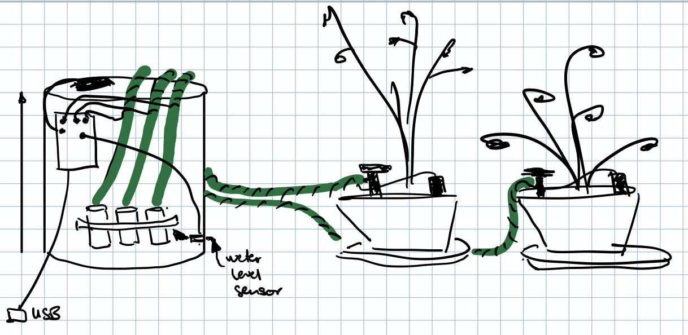
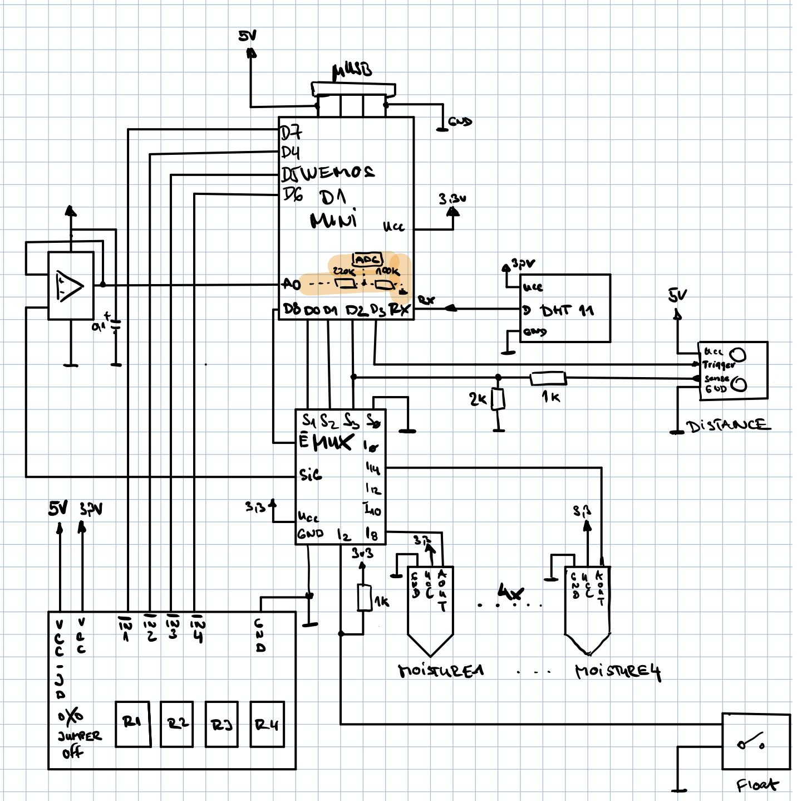
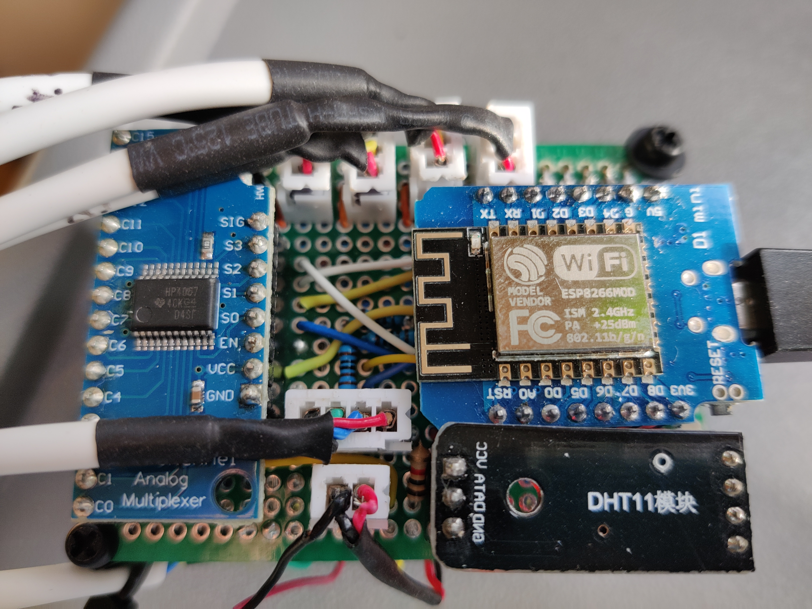

# Plantz - Simple plants watering automation using EP8266

I built this, so that I could take care of my plants while I'm abroad. The system gives me information about:
* air temperature
* air relative humidity
* soil moisture from 4 independent sensors
* tank water level
* safety water level indicator

I can also individually turn on 4 pumps that have piping to my plants. I linked groups of plants to a same pump. For example I have 4 cactuses and all are watered together, since they all require same level of water.
Currently I don't have a plan to automate watering. If I need to I manualy execute mqtt command to turn on pump #X for number of seconds. It takes a while for the moisture to reach the sensor.

# Components
- [Code that runs on ESP8266](espruino)
- [MQTT2ZBX - Connector from MQTT to Zabbix for monitoring](mqtt2zbx)
- Hardware (bellow)

# V0 - POC
- [x] can monitor environment
- [x] on demand turning on pumps
- [x] publish data to zabbix

## Schematic

## Hardware

V0 hardware is very crude. I had a limited set of tools and components to build this.
You can check out [the gallery with a few photos](docs/photos).

Notable hacks are:
- removing protection diode from Wemos D1 mini to get proper 5V on the 5V pin
- adding bunch of caps to reduce interference
- dual power - 5V to D1 mini and 5V separately to pumps

## Parts list
 * TODO

# V1
## Lessons learned
### Bad
V0 hardware has quite a few drawbacks, that I'd like to address in V1. 
Most importantly there are 4 pumps and amount of tubing is ridiculous. Same goes for moisture sensors and their wiring. Most of the effort to build this was spent on cabling. Simple pumps have one more major drawback. **Outlets have to be aboove the water level of the tank!!!**
Otherwise even when you stop the pump, the flow continues due to gravity/fluid dynamics.
From the electronics perspective I think for V1 I'll go with a single 12V power and take 5V off it for Wemos as necessary. This will go nicely with more powerful peristaltic pump.
For moisture sensors I'll go for 1wire bus based approach because shorter/longer wires do not allow for accurate results. 

| Sensor | Min(dry air) | Max(100%wet soil) |
| ---    | ---          | ---  |
| M1     | 0.83         | 0.41 |
| M2     | 0.83         | 0.39 |
| M3     | 0.83         | 0.38 |
| M4     | 0.83         | 0.39 |

### Good
Solution works fine and I'm surprised that it worked without major problems for 3 months I've been away. Ultrasonic level measurement works pretty good. Moisture sensors work fine apart from cable offset. Temperature is indicated correctly as well.

## Ideas
- [ ] HW replace 4x pumps with single peristaltic pump
- [ ] HW use 3way valves to distribute water
- [ ] HW use 1wire based capacitive soil moisture sensors
- [ ] HW simplify wiring
- [ ] HW use better environment sensor - futher from the main board
- [ ] HW Use single 12V supply
- [ ] HW Design custom board + casing for main module and sensor/valves
- [ ] HW add manual drain valve
- [ ] SW App for monitoring and watering
- [ ] SW server side alarm logic
- [ ] SW hysteresis based server side watering logic

